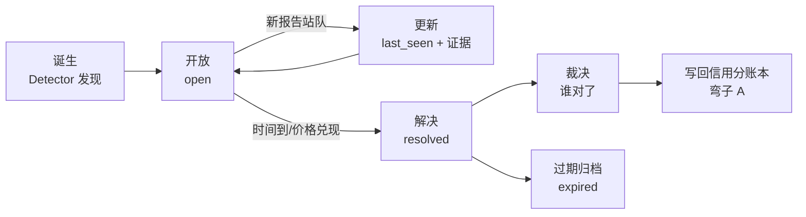
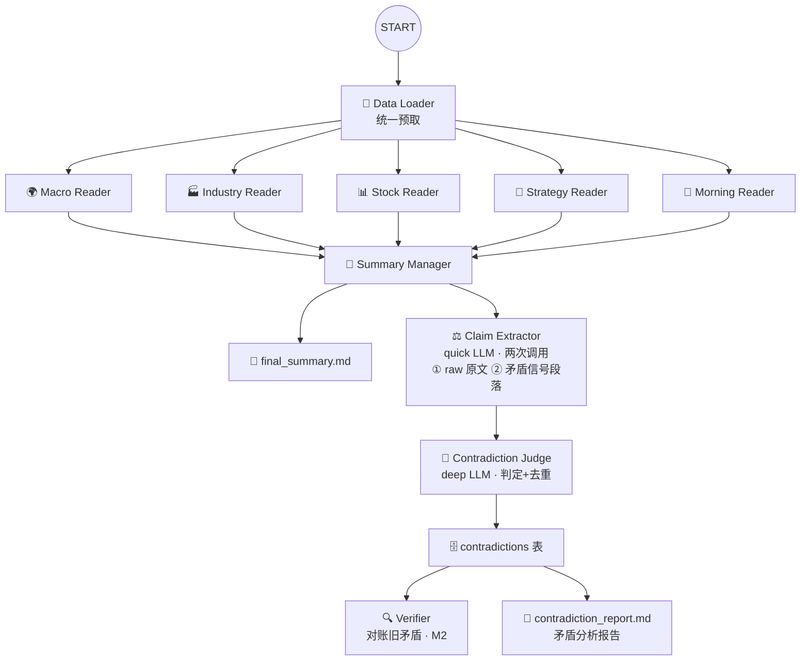

# 研报矛盾信号分析功能文档

> **状态**: 功能文档 | **版本**: v2.0 | **日期**: 2026-08-13
>
> 关联: [`research-report-agents.md`](research-report-agents.md)（现有 v2.0 架构）、[`research-report-brainstorm.md`](research-report-brainstorm.md)（差异化弯子）、[`research-report-contradiction-insight.md`](research-report-contradiction-insight.md)（矛盾洞察 FR-7）

---

## 目录

1. [功能概述](#1-功能概述)
2. [功能需求](#2-功能需求)
3. [设计依据：核心洞察与矛盾类型学](#3-设计依据核心洞察与矛盾类型学)
4. [数据模型](#4-数据模型)
5. [矛盾生命周期](#5-矛盾生命周期)
6. [技术实现](#6-技术实现)
7. [输出设计](#7-输出设计)
8. [与其他功能的关系](#8-与其他功能的关系)
9. [落地计划](#9-落地计划)
10. [验收标准](#10-验收标准)
11. [已知边界与风险](#11-已知边界与风险)

---

## 1. 功能概述

### 1.1 一句话

**当多个券商在同一对象上给出矛盾信号时，系统自动记录、分类、追踪，并在后续通过市场结果验证谁对——把"矛盾"从一段一次性 free text 变成可检索、可追踪、可验证的研究资产。**

### 1.2 功能定位

矛盾信号分析是研报阅读系统（v2.0）之上的新增并行能力，不替代现有 5 Reader + Summary Manager 主链路，而是：

- **横向**：对 5 类研报做跨类别、跨券商的结构化矛盾检测
- **纵向**：对历史未决矛盾做跨天追踪与市场验证
- **反哺**：把未决矛盾注入 Summary Manager，影响置信度

### 1.3 现状与差距

当前 Summary Manager 的 prompt 里已有一句"标记一致信号和矛盾信号"，`final_summary.md` 会输出一段"交叉验证发现"：

```
### 交叉验证发现
- **一致信号**: ...
- **矛盾信号**:
  1. AI算力"基本面强" vs "交易面弱"：...
  2. 策略防御 vs 个股进攻：...
  ...
```

问题在于：

| 短板         | 现状                                 | 后果                       |
| ------------ | ------------------------------------ | -------------------------- |
| **一次性**   | 矛盾只是当日报告里的一段 free text   | 明天就被覆盖，无法积累     |
| **不可检索** | 没有结构化字段（对象、方向、券商）   | 无法回答"哪些矛盾仍在持续" |
| **不可追踪** | 没有生命周期                         | 不知道矛盾后来被谁解决了   |
| **不可验证** | 没有对账                             | 不知道哪一方对了，无法打假 |
| **不反哺**   | Summary Manager 只"提一句降低置信度" | 矛盾没有转化为可用信号     |

**结论**：矛盾信号是当前系统里"最有信息量却最不被当回事"的部分。本功能把它从"一句话"升级为"一等公民"。

### 1.4 目标与非目标

| 目标                                | 非目标                          |
| ----------------------------------- | ------------------------------- |
| 当日跨券商矛盾的结构化检测与分类    | 预测市场方向 / 自动交易         |
| 跨天追踪矛盾生命周期（未决 → 解决） | 取代 Summary Manager 的综合判断 |
| 用市场结果验证事实矛盾，裁决谁对    | 对观点矛盾判定对错              |
| 反哺 Summary Manager 置信度         | 实时行情推送（按天批处理即可）  |

## 2. 功能需求

### FR-1：Claim 结构化抽取

| 项   | 说明                                                                                        |
| ---- | ------------------------------------------------------------------------------------------- |
| 描述 | 从 5 类研报原始文本中抽取结构化 Claim（券商、对象、方向、强度、时间尺度、目标价、原文证据） |
| 输入 | `macro_raw` / `industry_raw` / `stock_raw` / `strategy_raw` / `morning_raw`                 |
| 输出 | `claims`（JSON：该日全部 Claim 元组）                                                       |
| 验收 | 每类研报至少产出可解析 JSON；`direction ∈ {-1,0,1}`、`horizon` 必填                         |

### FR-2：矛盾检测与分类

| 项   | 说明                                                                                                       |
| ---- | ---------------------------------------------------------------------------------------------------------- |
| 描述 | 对当日 Claim 两两配对，判定矛盾并打标：`kind`（事实/观点）、`scope`（直接/间接）、`scale`（同尺度/跨尺度） |
| 输入 | `claims` + 历史矛盾表（去重用）                                                                            |
| 输出 | 当日新增/更新矛盾列表（写库）                                                                              |
| 验收 | 同一对券商 + 同一对象的矛盾复用同一 `id`（不重复入库）；跨尺度矛盾进观察区                                 |

### FR-3：矛盾持久化与生命周期

| 项   | 说明                                                                                                 |
| ---- | ---------------------------------------------------------------------------------------------------- |
| 描述 | 矛盾写入 SQLite `contradictions` 表，维护 `first_seen` / `last_seen` / `status` 生命周期             |
| 验收 | 每日运行后表内数据可检索；`status` 覆盖 `open / resolved`，`resolved_by ∈ market / report / expired` |

### FR-4：市场验证（Verifier）

| 项   | 说明                                                                      |
| ---- | ------------------------------------------------------------------------- |
| 描述 | 纯计算对账：目标价触及、评级方向兑现、财报落地 → 裁决 `winner`            |
| 验收 | 事实矛盾在声明 horizon 到期后可裁决；无价格数据时标 `pending`，不强行裁决 |

### FR-5：矛盾报告输出

| 项   | 说明                                                                      |
| ---- | ------------------------------------------------------------------------- |
| 描述 | 每日生成 `contradiction_report.md`：今日新增 / 仍在持续 / 今日解决 / 统计 |
| 验收 | 输出到 `reports/{date}/`，与 6 份现有报告并列                             |

### FR-6：反哺 Summary Manager

| 项   | 说明                                                         |
| ---- | ------------------------------------------------------------ |
| 描述 | 未决事实矛盾注入 Summary Manager prompt，相关对象降低置信度  |
| 验收 | 当日 final_summary 中相关条目置信度 ≤ 中，且明确引用未决矛盾 |

## 3. 设计依据：核心洞察与矛盾类型学

### 3.0 核心洞察

> 一致是共识，共识**已被定价**；矛盾是预期差，预期差才是**信息**。

- 10 家券商齐声看多 → 这已经反映在价格里，读它只是确认
- 5 家看多、5 家看空 → 说明存在未被市场消化的分歧，**方向性机会与风险并存**
- 券商之间互相矛盾 → 至少有一方会错，**这就是可验证、可打假的原料**

所以矛盾分析不是"给 Summary Manager 减分用的点缀"，而是**研报系统从"摘要工具"升级为"研究工具"的跃迁点**。

矛盾不是铁板一块，先分类才能设计。按**四个维度**切：

### 3.1 按事实性：事实矛盾 vs 观点矛盾（最重要）

| 类型         | 定义                     | 示例                                                        | 处理                                    |
| ------------ | ------------------------ | ----------------------------------------------------------- | --------------------------------------- |
| **事实矛盾** | 对同一客观事实的陈述相反 | A 券商："7 月乘用车零售 +5%"；B 券商："7 月乘用车零售 -18%" | 至少一方错 → **可打假**，进账本验证     |
| **观点矛盾** | 对同一标的的评估相反     | A："买入 博迁新材，目标价 40"；B："中性"                    | 只是偏好分歧 → 记录分歧度，不做对错判定 |

> 事实矛盾是弯子 A（信用分账本）的天然原料；观点矛盾是弯子 B（分歧指数）的原料。

### 3.2 按作用对象：直接矛盾 vs 间接矛盾

| 类型         | 定义                 | 示例                                                                                   |
| ------------ | -------------------- | -------------------------------------------------------------------------------------- |
| **直接矛盾** | 同一对象上的相反表态 | 策略说"减配科技"，个股研报对 AI 链给"买入"                                             |
| **间接矛盾** | 需要推理链才能发现   | 宏观说"降息预期升温"，策略却说"看好银行"（低利率反而利好银行——这不矛盾，需要推理判断） |

### 3.3 按表达方式：显性矛盾 vs 隐性矛盾

| 类型         | 定义                       | 示例                                                 |
| ------------ | -------------------------- | ---------------------------------------------------- |
| **显性矛盾** | 字面直接冲突               | 同一股票评级相反、目标价互相打脸                     |
| **隐性矛盾** | 用词模糊，需归一化后才暴露 | "维持买入，建议关注回调" vs "超配"——方向相同强度不同 |

### 3.4 按时间尺度：同尺度矛盾 vs 跨尺度矛盾

| 类型       | 定义                             | 示例                                                         |
| ---------- | -------------------------------- | ------------------------------------------------------------ |
| **同尺度** | 两个 claim 的时间窗口可比        | 都是"未来 6 个月"，一个看多一个看空                          |
| **跨尺度** | 时间窗口不同，**可能其实不矛盾** | 策略"季度减配科技" vs 个股"短期买入"——这是最常见的**假矛盾** |

> 跨尺度矛盾是**误报重灾区**。减配 vs 买入可以在同一时点同时成立（仓位再平衡），必须靠 `horizon` 字段过滤。

---

## 4. 数据模型

> 存储位置：`reports/contradictions.db`（SQLite，`sqlite3` 标准库，连接模式对齐 `tradingagents/graph/checkpointer.py`）

### 4.1 Claim 元组（把研报变成可计算的命题）

每篇研报解析出一组 Claim 元组：

```python
Claim = {
    "broker":     str,     # 券商
    "author":     str,     # 分析师（可选）
    "report_type": str,    # 宏观/行业/个股/策略/晨报
    "subject":    str,     # 对象（标的/行业/资产/宏观变量）
    "direction":  -1|0|1,  # 方向：看空/中性/看多
    "strength":   0~1,     # 强度（"强烈推荐" 0.9，"建议关注" 0.3）
    "horizon":    str,     # 时间尺度：短期/中期/长期/6个月/12个月
    "target":     float|None,  # 目标价（若有）
    "quote":      str,     # 原文证据（可溯源）
    "date":       date,    # 报告日期
}
```

### 4.2 Contradiction 判定（把两个 Claim 变成一条矛盾）

```python
Contradiction = {
    "id":          str,        # 稳定 ID，跨天追踪用
    "pair":        (Claim, Claim),
    "kind":        "factual" | "opinion",   # 事实/观点
    "scope":       "direct" | "indirect",   # 直接/间接
    "scale":       "same" | "cross",        # 同尺度/跨尺度
    "subject":     str,        # 共同对象
    "resolution":  "open" | "resolved",     # 生命周期状态
    "resolved_by": str | None, # 谁解决了它（新报告站队？市场验证？）
    "winner":      "A" | "B" | "both" | None,  # 验证后谁对
    "first_seen":  date,
    "last_seen":   date,
}
```

**判定规则（最小集）**：

1. `subject` 可归一化对齐（同一股票/行业/资产；v3.2 起做**同义词归一化**：光模块/CPO/光通信/光通信板块 → 光模块）
2. `direction` 相反（-1 vs 1）是矛盾；**中性(0) vs 看多(1)/看空(-1) 也是矛盾**（方向/强度分歧，v3.2 放宽——否则"强烈乐观 vs 中性"这类会漏检）；同向但 `strength` 差超过阈值 → 强度矛盾
3. `horizon` 可比较（`same` 才进主列表；`cross` 标记为"疑似假矛盾"进观察区）
4. `kind` 判定：claim 指向客观数据（价格/销量/政策）→ factual；指向评级/配置 → opinion

### 4.3 存储

新建 `contradictions` SQLite 表（与弯子 A 的 `prediction_ledger` 同库分表，或独立库）：

```sql
CREATE TABLE contradictions (
    id           TEXT PRIMARY KEY,       -- f"{subject}|{brokerA}|{brokerB}|{kind}"
    subject      TEXT NOT NULL,
    kind         TEXT NOT NULL,          -- factual | opinion
    scope        TEXT NOT NULL,          -- direct | indirect
    scale        TEXT NOT NULL,          -- same | cross
    claim_a      TEXT NOT NULL,          -- JSON: Claim
    claim_b      TEXT NOT NULL,
    horizon_a    TEXT,                   -- 冗余存 horizon，便于 SQL 过滤跨尺度
    horizon_b    TEXT,
    status       TEXT NOT NULL DEFAULT 'open',  -- open | resolved
    winner       TEXT,                   -- A | B | both
    resolved_by  TEXT,                   -- 'market' | 'report' | 'expired'
    resolved_date TEXT,
    first_seen   TEXT NOT NULL,
    last_seen    TEXT NOT NULL
);
CREATE INDEX idx_contradictions_status ON contradictions(status);
CREATE INDEX idx_contradictions_subject ON contradictions(subject);
```

---

## 5. 矛盾生命周期

记录只是起点，真正的价值在**追踪矛盾如何被解决**：



| 阶段     | 触发                                         | 动作                                                                     |
| -------- | -------------------------------------------- | ------------------------------------------------------------------------ |
| **诞生** | 当日 Detector 发现新矛盾                     | 生成 `Contradiction`，`status=open`                                      |
| **更新** | 后续报告再次提及同一对象                     | `last_seen` 刷新，附新证据；若新报告明确站队 → 记录 `resolved_by=report` |
| **解决** | 市场验证（目标价触及/评级方向兑现/财报落地） | `status=resolved`，`winner` 判给兑现方向的一方                           |
| **过期** | 超过声明 horizon 仍未解决                    | `status=resolved, resolved_by=expired`（时间证明双方都没兑现 → 都算输）  |
| **反哺** | 每次裁决完成                                 | 写回弯子 A 信用分：**事实矛盾中判对的一方加分**                          |

---

## 6. 技术实现

### 6.1 新增文件清单

```
tradingagents/agents/research_report/
├── claim_extractor.py        # FR-1  Claim 抽取（quick LLM）
├── contradiction_judge.py    # FR-2  矛盾判定 + 分类（deep LLM）
├── contradiction_store.py    # FR-3  SQLite 持久化（无 LLM）
├── verifier.py               # FR-4  市场验证对账（无 LLM）
└── contradiction_report.py   # FR-5  矛盾报告生成（deep LLM）

tradingagents/graph/research_report_graph.py   # 注册新节点 + 串行分支
run_report_reader.py                          # 保存 contradiction_report.md、--db 参数
```

### 6.2 图拓扑（v3.2）

在现有 v2.0（Loader → 5 Reader 并行 → Summary Manager）基础上，**串行追加矛盾分析分支**——研报分析完成后立即执行，且 Claim Extractor **两次调用**：先抽 5 类原文 claim，再专门抽取 `final_summary` 的"矛盾信号"段落（保证 Summary Manager 发现的矛盾不因混在 120KB 原文里而漏抽）：



| 节点                          | LLM                | 职责                                                                                                              |
| ----------------------------- | ------------------ | ----------------------------------------------------------------------------------------------------------------- |
| **Claim Extractor**           | quick              | 两次调用：① 5 类 `*_raw` 抽 claim ② `final_summary` 矛盾信号段落抽成对 claim（券商名照抄，无则 `SummaryManager`） |
| **Contradiction Judge**       | deep               | 判定矛盾、分类（factual/opinion、direct/indirect、scale）、与历史矛盾去重                                         |
| **Verifier**                  | 无 LLM（纯计算）   | 每日对账旧矛盾：查价格/评级变更，裁决 `winner`，写回账本                                                          |
| **Contradiction Report 生成** | 无 LLM（代码渲染） | 汇总"今日新增/已解决/仍在持续"，产出独立报告                                                                      |

### 6.3 关键设计决策

- **Claim 抽取放 quick、判定放 deep**：抽取是机械的结构化任务，判定需要推理（间接矛盾）——与现有 quick/deep 分工一致
- **串行在 Summary Manager 之后**：研报分析完成后再做冲突分析（用户心智：先总结，再找冲突）
- **Claim Extractor 两次调用（v3.2）**：`final_summary` 的"矛盾信号"是 Summary Manager 交叉验证的成果，若混在 ~120KB 原文后面一起抽会被 LLM 漏掉。单独一次调用专门把每条矛盾信号抽成**成对 claim**（side_a/side_b，券商名照抄，无券商名标 `SummaryManager`），保证 final_summary 里发现的矛盾（光模块/军工/估值等）全部进入判定
- **Judge 判定放宽（v3.2）**：`中性(0) vs 乐观/悲观(±1)` 也是矛盾（"强烈乐观 vs 中性"此前漏检）；`subject` 同义词归一化（光模块/CPO/光通信 → 光模块），避免同一对象因表述不同而检不出
- **容错不阻塞主报告**：矛盾分支各节点 LLM 调用失败时返回空结果并告警，绝不影响 `final_summary` 等主报告落盘
- **去重靠 subject + broker 对**：同一对券商对同一标的的矛盾跨天复用同一 `id`，`last_seen` 更新——避免每天重复记
- **抽取直接从 raw 做**：v2.0 的 Data Loader 已把 5 类原文放进 `*_raw`，抽取节点直接读即可拿到原文 quote 供打假溯源，不额外增加 Reader 调用

### 6.4 实现要点（对齐现有代码风格）

#### 6.4.1 Claim Extractor —— 复用 Reader 工厂模式，**两次调用（v3.2）**

与 `stock_reader.py` 相同的 factory 模式（quick LLM，SystemMessage + HumanMessage），但要求输出严格 JSON。第一次抽 5 类原文，第二次**专门抽 final_summary 的"矛盾信号"段落**：

```python
# claim_extractor.py —— 骨架（v3.2）
CLAIM_EXTRACTOR_SYSTEM = """你是研报观点抽取器。从研报中抽取结构化 Claim。
只输出 JSON 数组，每项: {"broker","author","report_type","subject",
"direction","strength","horizon","target","quote"}
规则: direction ∈ {-1,0,1}; horizon ∈ {短期,中期,长期}; quote 必须原文逐字。"""

MANAGER_CONFLICT_SYSTEM = """你是研报矛盾信号解析器。给定综合投资建议中的"矛盾信号"段落，
把每条矛盾信号解析成一对 claim。
只输出 JSON 数组，每项: {"subject", "side_a": {"broker","direction","quote"},
"side_b": {"broker","direction","quote"}}
规则: broker 用条目中的券商名；未提券商名的一侧用 "SummaryManager";
direction: 看多=1, 看空=-1, 中性=0; quote 用条目原文片段。"""

def create_claim_extractor(llm):
    def claim_extractor_node(state: dict) -> dict:
        raw = "\n\n".join(state.get(f, "") for f in _RAW_FIELDS)
        claims = _extract_or_empty(llm, CLAIM_EXTRACTOR_SYSTEM,
                                   f"研报原文：\n\n{raw}", "raw")
        final_summary = state.get("final_summary", "")
        if final_summary:
            pairs = _extract_or_empty(llm, MANAGER_CONFLICT_SYSTEM,
                                      f"矛盾信号段落：\n\n{final_summary}", "manager")
            claims.extend(_pair_to_claims(pairs))   # 每对展开成 2 条 claim
        return {"claims": json.dumps(claims, ensure_ascii=False)}
    return claim_extractor_node
```

> `_extract_or_empty`：LLM 调用/JSON 解析失败时返回 `[]`（容错，不阻塞主链路）。
> 保证 `final_summary` 里 Summary Manager 发现的矛盾（如"光模块：基本面 vs 隔夜美股暴跌"）不再因混在 120KB 原文里被漏抽。

#### 6.4.2 Contradiction Judge —— deep LLM + 判定规则写死在 prompt

- 输入：`claims`（当日 JSON）+ 库内历史矛盾摘要（`contradiction_store.list_summary()`）
- 输出：JSON 矛盾数组（含 `subject/kind/scope/scale/claim_a/claim_b`），节点内部计算去重 `id` 并 `upsert`
- 判定规则在 prompt 中显式给出（v3.2）：
  - **方向相反（-1 vs 1）是矛盾；中性(0) vs 看多(1)/看空(-1) 也是矛盾**（方向/强度分歧）
  - **subject 同义词归一化**：光模块/CPO/光通信/光通信板块 视为同一对象；同一主题的不同表述合并
  - 同向但 `strength` 差超阈值 → 强度矛盾；`scale` 过滤（cross 进观察区）；factual/opinion 分类

#### 6.4.3 Contradiction Store —— 无 LLM，纯 `sqlite3`

- `upsert(contradictions)`：按 `id = f"{subject}|{brokerA}|{brokerB}|{kind}"` 去重；存在则更新 `last_seen` + 追加站队证据，否则插入
- `list_open()` / `list_summary()`：供 Verifier 与反哺读取
- `resolve(id, winner, resolved_by)`：写状态
- `check_same_thread=False`，连接模式对齐 `tradingagents/graph/checkpointer.py`

#### 6.4.4 Verifier —— 纯计算，每日跑批

- 遍历 `list_open()`：
  - 有目标价 → 拉当前价（暂无价格源则标 `pending`，不硬裁）
  - 事实矛盾 → 用后续数据（财报/官方统计）校验，裁决 `winner`
  - 超 horizon → `resolved_by=expired`
- 裁决写回表，并预留写回弯子 A 信用分接口

#### 6.4.5 Contradiction Report —— deep LLM 渲染

- 读库内四类数据（今日新增 / 仍在持续 / 今日解决 / 统计），按 [第 7 章](#7-输出设计) 的模板渲染 markdown

#### 6.4.6 图注册（`research_report_graph.py`）

在 `_build()` 中追加串行分支（研报分析完成后执行）：

```python
workflow.add_node("Claim Extractor", create_claim_extractor(self.quick_llm))
workflow.add_node("Contradiction Judge",
                  create_contradiction_judge(self.deep_llm, self.contradiction_store))
workflow.add_node("Contradiction Report",
                  create_contradiction_report(self.contradiction_store))

for node_key, _factory in _READERS:
    workflow.add_edge(node_key, "Summary Manager")   # 既有

workflow.add_edge("Summary Manager", "Claim Extractor")   # 串行：先总结后冲突
workflow.add_edge("Claim Extractor", "Contradiction Judge")
workflow.add_edge("Contradiction Judge", "Contradiction Report")
workflow.add_edge("Contradiction Report", END)
```

> 反哺（FR-6）在 M3 再做：Judge 把未决矛盾写入 state 字段，Summary Manager 读取后降低相关条目置信度。

#### 6.4.7 state.py 变更

```python
class ResearchReportState(MessagesState):
    # ...existing fields...
    claims: Annotated[str, "当日全部 Claim 元组（JSON 字符串）"]
    contradictions: Annotated[str, "当日判定结果（JSON 字符串）"]
    contradiction_report: Annotated[str, "矛盾分析报告（markdown）"]
```

#### 6.4.8 CLI / 运行脚本变更（`run_report_reader.py`）

- 新增 `--db` 参数（默认 `reports/contradictions.db`）
- 图运行后把 `contradiction_report` 写入 `{out_dir}/contradiction_report.md`，与现有 6 份报告并列

### 6.5 配置项

| 配置                               | 默认值                      | 说明                               |
| ---------------------------------- | --------------------------- | ---------------------------------- |
| `contradictions_db`                | `reports/contradictions.db` | SQLite 路径                        |
| `contradiction_strength_threshold` | `0.3`                       | 同向强度差阈值，超过才判强度矛盾   |
| `contradiction_cross_scale`        | `observe`                   | 跨尺度矛盾默认进观察区，不进主列表 |

---

## 7. 输出设计

### 7.1 每日独立报告 `contradiction_report.md`

```
# 矛盾信号分析报告
**日期**: 2026-08-10

## 🔴 今日新增矛盾
| 对象 | 矛盾类型 | 券商A vs 券商B | 证据 |
|------|---------|---------------|------|
| AI算力 | 观点/间接/跨尺度 | 国元"阶段性减配" vs 中邮"买入" | ... |

## 🟡 仍在持续（历史未决）
| 对象 | 首次发现 | 持续天数 | 双方立场 | 最新站队 |
|------|---------|---------|---------|---------|
| 光伏 | 2026-07-28 | 13 天 | 政策强 vs 价格弱 | 新增 2 篇看空 |

## 🟢 今日解决（市场裁决）
| 对象 | 存续天数 | 谁对 | 依据 |
|------|---------|------|------|
| 乘用车零售 | 5 天 | 券商B（-18%） | 中汽协数据落地 |

## 📊 矛盾统计
- 累计矛盾：N 条 | 已解决：M | 解决率：X%
- 事实矛盾券商准确率 Top 榜（联动弯子 A）
```

### 7.2 反哺 Summary Manager

- 历史矛盾（`status=open` 且 `kind=factual`）注入 Summary Manager prompt：**当今天的报告内容与某个未决矛盾相关时，明确提示"该对象存在未决事实分歧"**，降低该条目的置信度
- 而不是像现在这样只靠模型自觉"提一句"

### 7.3 报告可读性改进（v3.3，2026-08-15）

> 2026-08-13 实跑后回看 `contradiction_report.md`（22 条未决），当前形态"不直观、很乱"。问题诊断与改进方案记录如下。

#### 7.3.1 问题诊断

| # | 问题 | 根因 | 位置 |
|---|------|------|------|
| 1 | 每条矛盾重复出现 2 遍 | `list_open()` 未排除当日新增，与 `new_since(day)` 结果重叠（新增 11 条全部在"持续"区再次出现） | `contradiction_store.py` |
| 2 | 同主题多条爆炸且无序 | 矛盾 id 含券商对，同一 subject 下多条（如"美联储利率/政策"4 条）；`ORDER BY last_seen DESC` 使新旧矛盾混排，无时间线 | `contradiction_store.py` / `contradiction_report.py` |
| 3 | 无概览/导航，上来就是条目墙 | 报告顶部只有日期，无 Top 关注、无按类型/方向/持续天数的分布统计 | `contradiction_report.py` |
| 4 | 洞察块冗长且雷同 | 每条矛盾 2 行 claim + 4 行洞察（每行 50~100 字）；LLM 输出同质化（"时间尺度"型点评几乎雷同、tilt 清一色"不确定"），信息密度低但占版面最大 | insight 节点 prompt |
| 5 | 格式单调、无视觉层次 | 全部嵌套无序列表；`opinion/direct/cross` 英文枚举裸露；claim 原文硬截断 60 字导致断句（"……收益率下行将触发空头回补并放"） | `contradiction_report.py` |
| 6 | "今日解决"常驻空区块 | 已解决为 0 时仍渲染标题与空内容 | `contradiction_report.py` |
| 7 | 统计过于单薄 | 仅一行累计/未决/已解决，无按 kind/cause_type/持续天数的分布 | `contradiction_report.py` |

#### 7.3.2 改进方案（按性价比排序）

1. **三区互斥**（最小改动，立即做）：`list_open()` 增加 `first_seen != day` 条件（或渲染层排除），消除"新增/持续"重叠
2. **顶部概览表**：新增"今日矛盾速览"区——一屏看完 `对象 | 双方方向 | 类型 | 持续天数`，正文再展开详情
3. **洞察折叠为摘要**：每条只显示 `cause_type + 倾向` 一行，成因/点评/验证折叠进详情
4. **按 subject 聚合**：同 subject 多条矛盾分组展示，组内再列券商对，保留演化时间线
5. **细节修正**：去除 60 字硬截断（改为完整 quote 或省略号语义化）、`kind/scope/scale` 中文化映射、空区块不渲染、统计区增加分布

#### 7.3.3 验收

- 报告任意两条矛盾间无重复文本；新增 / 持续 / 解决三区互斥
- 顶部概览一屏可读完当日矛盾分布
- 洞察默认只占 1~2 行，详情按需展开

---

## 8. 与弯子 A / B 的关系

| 弯子                        | 关系                                                              | 复用点                          |
| --------------------------- | ----------------------------------------------------------------- | ------------------------------- |
| **弯子 A（信用分账本）**    | 矛盾裁决结果写回信用分：事实矛盾判对方加分                        | 同一 SQLite 库、同一对账节奏    |
| **弯子 B（共识/分歧指数）** | 矛盾就是分歧的极端形态：`kind=opinion` 的矛盾天然是分歧指数的原料 | Claim 抽取共用一套结构化 schema |

> 三个功能的共享地基：**同一套 Claim 结构化抽取 + 同一张 SQLite 账本**。先做地基，三个功能都能长出来。

---

## 9. 落地计划

> 分 3 个里程碑，每步结束都有一个**可运行的自检**（最小验证，不引测试框架）。先跑通闭环，再逐级加深。

### M1：矛盾检测闭环（FR-1 / FR-2 / FR-3 / FR-5）

| 步骤 | 内容                                                                       |
| ---- | -------------------------------------------------------------------------- |
| 1    | `claim_extractor.py` + `contradiction_store.py` + `contradiction_judge.py` |
| 2    | 图注册并行分支（见 6.4.6）                                                 |
| 3    | `contradiction_report.py` 输出报告 + CLI 保存（见 6.4.8）                  |

**自检**：跑 `run_report_reader.py --date <某日>`，断言 `reports/{date}/contradiction_report.md` 存在且 `contradictions` 表有新记录；再跑一次，断言 `id` 复用（不重复插入）。

### M2：市场验证（FR-4）

| 步骤 | 内容                                     |
| ---- | ---------------------------------------- |
| 1    | `verifier.py` 纯计算对账                 |
| 2    | 目标价数据接入（复用主流水线价格数据流） |

**自检**：构造一条已知会兑现的矛盾（如目标价已触及），断言 `winner` 正确裁决、`status=resolved`。

### M3：反哺与信用分（FR-6 + 弯子 A）

| 步骤 | 内容                                |
| ---- | ----------------------------------- |
| 1    | 未决矛盾注入 Summary Manager prompt |
| 2    | 裁决结果写回信用分账本              |

**自检**：当日存在未决事实矛盾时，断言 final_summary 相关条目置信度 ≤ 中。

---

## 10. 验收标准

| 编号 | 验收项       | 通过条件                                                    |
| ---- | ------------ | ----------------------------------------------------------- |
| AC-1 | Claim 抽取   | 5 类研报各产出可解析 JSON，`direction / horizon` 字段完整   |
| AC-2 | 矛盾去重     | 同券商对 + 同对象跨天复用 `id`，`last_seen` 更新            |
| AC-3 | 分类正确     | 抽样 20 条矛盾，`kind / scope / scale` 人工复核准确率 ≥ 90% |
| AC-4 | 生命周期     | 构造已兑现矛盾，Verifier 正确裁决 `winner` 并更新 `status`  |
| AC-5 | 报告输出     | `contradiction_report.md` 含新增 / 持续 / 解决 / 统计四区   |
| AC-6 | 主链路无回归 | 有矛盾分支 vs 无矛盾分支，`final_summary.md` 均可正常产出   |
| AC-7 | 反哺生效     | 存在未决事实矛盾时，final_summary 相关条目置信度 ≤ 中       |

---

## 11. 已知边界与风险（ponytail）

- **跨尺度假矛盾**：`horizon` 归一化只能缓解不能根除——策略与个股天然时间尺度不同，`scale=cross` 的矛盾先进观察区，人工抽查校准阈值
- **间接矛盾误报**：推理型矛盾（宏观→行业传导）需要 deep LLM 判断，存在 precision/recall 权衡；先保 precision（宁缺毋滥），避免报告被噪音淹没
- **quote 溯源弱**：从 summary 抽取时原文证据已丢失，打假裁决（步骤 4）需要原文时，再补 raw 抽取（升级路径已预留）
- **冷启动**：Verifier 需要历史矛盾积累才有裁决可做；前两周以"记录+报告"为主，裁决率随天数自然上升
- **裁决标准依赖数据源**：目标价对账依赖价格数据质量；无价格数据的矛盾标记为 `pending`，不强行裁决
