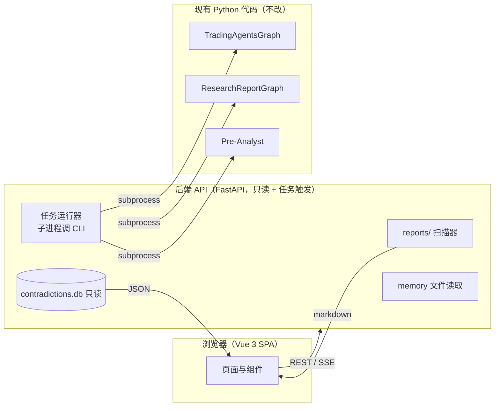
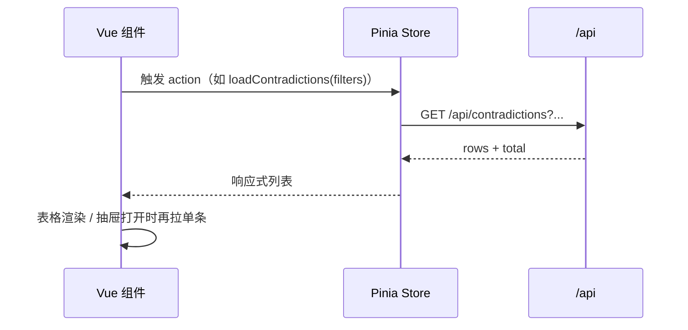
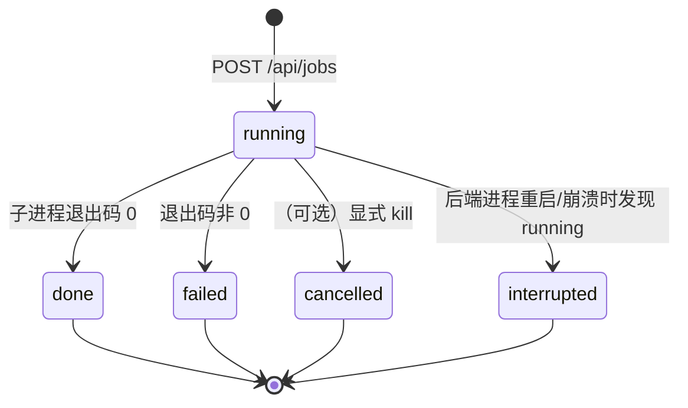

# TradingAgents Vue 前端设计文档

> **状态**: 设计文档 | **版本**: v0.3 | **日期**: 2026-08-15
>
> 关联: [`ARCHITECTURE.md`](../ARCHITECTURE.md)（系统架构）、[`research-report-agents.md`](research-report-agents.md)（研报阅读器）、[`research-report-contradiction.md`](research-report-contradiction.md)（矛盾分析 v3.3）

---

## 目录

1. [目标与范围](#1-目标与范围)
2. [现状盘点：前端要覆盖的功能](#2-现状盘点前端要覆盖的功能)
3. [总体架构](#3-总体架构)
4. [页面与路由](#4-页面与路由)
5. [各页面详细设计](#5-各页面详细设计)
6. [后端 API 设计](#6-后端-api-设计)
7. [前端技术栈与目录结构](#7-前端技术栈与目录结构)
8. [通用组件](#8-通用组件)
9. [状态管理与数据流](#9-状态管理与数据流)
10. [实施路线图](#10-实施路线图)
11. [验收标准](#11-验收标准)
12. [M2 任务中心实现设计](#12-m2-任务中心实现设计)

---

## 1. 目标与范围

### 1.1 一句话

**把 TradingAgents 三条功能线已经产出的报告、矛盾库与决策记忆，从"本地 markdown 文件 + SQLite"升级为可浏览、可筛选、可追踪的 Web 界面。**

### 1.2 目标

| 目标     | 说明                                                                   |
| -------- | ---------------------------------------------------------------------- |
| 报告浏览 | 在浏览器里阅读交易分析报告树、每日研报总结、Pre-Analyst 板块轮动报告   |
| 矛盾追踪 | 浏览/筛选矛盾库（v3.3 数据），查看双方立场、洞察、生命周期             |
| 任务运行 | 从页面上发起分析任务（analyze / reader / pre-analyst），查看进度与历史 |
| 决策记忆 | 浏览决策日志与反思记录                                                 |

### 1.3 非目标

| 非目标         | 说明                                                              |
| -------------- | ----------------------------------------------------------------- |
| 实时行情/图表  | 数据由现有 dataflows 层在任务运行中获取，前端不直连行情           |
| 前端直接调 LLM | 所有 LLM 调用仍在 Python 进程内（CLI/图），前端只读产物与下发任务 |
| 交易执行       | 沿用框架的"模拟交易所"，不新增任何下单能力                        |
| 替代 CLI       | CLI 保留；前端是 CLI 的可视化壳                                   |

---

## 2. 现状盘点：前端要覆盖的功能

### 2.1 三条功能线

| 功能线                                | 入口                          | 产物                                                                                                                                                                               | 前端页面             |
| ------------------------------------- | ----------------------------- | ---------------------------------------------------------------------------------------------------------------------------------------------------------------------------------- | -------------------- |
| **主交易图**（多 Agent 交易分析）     | `cli analyze` / `main.py`     | `reports/{TICKER}_{时间戳}/complete_report.md` + 分层目录 `1_analysts/` `2_research/` `3_trading/` `4_risk/` `5_portfolio/`                                                        | 交易分析             |
| **研报阅读器**（5 类研报 + 矛盾分析） | `run_report_reader.py --date` | `reports/{date}/` 下 7 个文件：`macro_summary.md` `industry_summary.md` `stock_summary.md` `strategy_summary.md` `morning_summary.md` `final_summary.md` `contradiction_report.md` | 研报阅读、矛盾追踪   |
| **Pre-Analyst**（板块轮动预分析）     | `run_pre_analyst.py --ticker` | `reports/pre_analyst_{时间戳}/`：`cyclical_analyst.md` `growth_analyst.md` `defensive_analyst.md` `sector_manager.md` `complete_report.md`                                         | 交易分析（列表并入） |

### 2.2 数据资产（前端的数据源）

| 资产             | 位置                                                                                  | 形态                                                | 读取方式        |
| ---------------- | ------------------------------------------------------------------------------------- | --------------------------------------------------- | --------------- |
| 主图报告树       | `reports/{TICKER}_{ts}/`                                                              | markdown 文件树                                     | 文件系统扫描    |
| 每日研报报告     | `reports/{date}/`                                                                     | 7 个 markdown                                       | 文件系统扫描    |
| Pre-Analyst 报告 | `reports/pre_analyst_{ts}/`                                                           | 5 个 markdown                                       | 文件系统扫描    |
| 矛盾库           | `reports/contradictions.db`                                                           | SQLite（`contradictions` 表，含 `insight` JSON 列） | SQLite 只读查询 |
| 决策记忆         | `~/.tradingagents/memory/trading_memory.md`（`TRADINGAGENTS_MEMORY_LOG_PATH` 可覆盖） | 单个 markdown                                       | 文件读取        |
| 配置             | `.env`（`TRADINGAGENTS_*`）与 `default_config.py`                                     | 键值                                                | 只读展示        |

### 2.3 矛盾数据模型（`contradictions` 表）

前端矛盾页直接映射以下列，**无需理解图内部**：

| 列                                                    | 前端用途                                                     |
| ----------------------------------------------------- | ------------------------------------------------------------ |
| `id`                                                  | 行唯一键（`subject\|brokerA\|brokerB\|kind`）                |
| `subject` / `kind` / `scope` / `scale`                | 分组与筛选（中文化映射见矛盾报告 v3.3）                      |
| `claim_a` / `claim_b`（JSON）                         | 双方立场卡片：broker、direction（-1/0/1）、quote             |
| `status` / `winner` / `resolved_by` / `resolved_date` | 生命周期（open / resolved）                                  |
| `first_seen` / `last_seen`                            | 时间线与持续天数                                             |
| `insight`（JSON）                                     | 洞察：`cause_type` / `cause` / `analysis` / `watch` / `tilt` |

---

## 3. 总体架构



设计原则：

1. **后端只读优先**：阶段 1 后端只扫描文件与查 SQLite，不 import TradingAgents 包、不持有 LLM 客户端，启动快、零风险。
2. **任务触发走子进程**：运行分析 = 后端 `subprocess` 调现有入口（`cli analyze` / `run_report_reader.py` / `run_pre_analyst.py`），进程退出即任务结束，与现有 checkpoint 机制天然兼容。
3. **路径安全**：所有文件读取做路径穿越防护（项目已有 `test_ticker_path_handling` 先例），URL 参数只允许 `[A-Za-z0-9._-]`。
4. **前端无状态读取**：所有"计算"（聚合、统计）尽量由 SQL/后端完成，前端只做展示与筛选。

---

## 4. 页面与路由

| 路由               | 页面     | 数据源         | 核心能力                           |
| ------------------ | -------- | -------------- | ---------------------------------- |
| `/`                | 仪表盘   | overview API   | 统计卡片 + 最近运行 + 今日矛盾 Top |
| `/reports/trading` | 交易分析 | 报告树 API     | 左树右文，agent 分层阅读           |
| `/reports/daily`   | 研报阅读 | 按日期 API     | 日期切换 + 7 个报告 tab            |
| `/reports/pre`     | 板块轮动 | 报告树 API     | Pre-Analyst 运行浏览               |
| `/contradictions`  | 矛盾追踪 | 矛盾 API       | 速览表 + 筛选 + 详情抽屉           |
| `/jobs`            | 任务中心 | jobs API + SSE | 发起/监控/历史任务                 |
| `/memory`          | 决策日志 | memory API     | 决策记忆 markdown                  |
| `/settings`        | 设置     | settings API   | LLM 配置与模型目录（只读）         |

布局：左侧导航栏（应用名 + 8 个入口）+ 顶栏（当前任务运行状态徽标）+ 内容区。移动端导航折叠为抽屉。

---

## 5. 各页面详细设计

### 5.0 视觉设计系统（设计语言）

**基调：暗色金融终端 × 现代 SaaS。** 金融内容需要长时间阅读，暗色护眼、红绿信号对比最强；质感走"克制的专业"——信息密度高但不拥挤，颜色只用来传达语义，不装饰。

#### 5.0.1 Design Tokens（CSS 变量，亮/暗双主题）

```css
:root[data-theme="dark"] {
  --bg-base: #0b0e14; /* 页面底色 */
  --bg-surface: #121722; /* 卡片 */
  --bg-elevated: #1a2130; /* 抽屉/浮层 */
  --bg-hover: rgb(79 140 255 / 0.06);
  --border: #232c3d;
  --text-1: #e6eaf2;
  --text-2: #9aa4b8;
  --text-3: #5c6678;
  --accent: #4f8cff; /* 主色：冷静蓝，只用于交互与强调 */
  --up: #ef4444;
  --flat: #8b93a7;
  --down: #22c55e; /* A股：红涨绿跌 */
  --warn: #f59e0b; /* 需关注信号（如持续天数 ≥ 7） */
  --radius-sm: 6px;
  --radius-md: 10px;
  --radius-lg: 14px;
  --shadow-1: 0 1px 2px rgb(0 0 0 / 0.4);
  --shadow-2: 0 8px 24px rgb(0 0 0 / 0.45);
  --font-mono: "JetBrains Mono", ui-monospace, "SF Mono", Consolas, monospace;
}
/* 亮色主题同构：bg #f5f7fa / surface #ffffff / border #e4e8ef / text-1 #1a2233 */
```

#### 5.0.2 色彩语义

| 语义      | 颜色          | 用途                 |
| --------- | ------------- | -------------------- |
| 看多/上涨 | `--up` 红     | 方向徽章、多头标签   |
| 看空/下跌 | `--down` 绿   | 方向徽章、空头标签   |
| 中性      | `--flat` 灰   | 中性方向、禁用态     |
| 主交互    | `--accent` 蓝 | 选中态、链接、主按钮 |
| 需关注    | `--warn` 琥珀 | 持续天数 heat、告警  |

洞察 `cause_type` 标签色：口径差异=蓝、时间尺度=紫、框架假设=橙、信息时效=青、立场差异=粉、其他=灰。

#### 5.0.3 字体与数字

- 界面中文：系统栈 `-apple-system, "Segoe UI", "Microsoft YaHei", sans-serif`
- **金融数据一律等宽**：标的、日期、天数、百分比用 `--font-mono`——表格列自动对齐，自带"终端感"
- 页面标题 20px/600；卡片标题 14px/600；正文 14px/400，行高 1.7

#### 5.0.4 动效与微交互

- 过渡统一 120–180ms `ease-out`，只动 `opacity/transform`
- 表格行 hover：背景微亮 + 左侧 2px accent 边条
- 路由切换 fade-up 240ms；抽屉右侧滑入
- 任务运行中：顶栏状态点**脉冲呼吸**；stepper 当前阶段脉动
- 尊重 `prefers-reduced-motion`，开启时全部降级为无动画

#### 5.0.5 空态 / 加载态 / 图标

- **空态**：居中图标 + 一句说明 + 行动按钮（如矛盾页空态 →"去任务中心发起研报阅读"），绝不裸显示空白
- **加载**：骨架屏（统计卡/表格按最终形状占位），不用全屏 spinner
- **图标**：线性风格 1.5px 描边、统一 20px 栅格；运行状态用实心点（完成绿 / 进行中蓝脉冲 / 失败红）

#### 5.0.6 响应式

| 断点       | 布局                                 |
| ---------- | ------------------------------------ |
| ≥1200px    | 侧边导航常驻 + 双栏内容              |
| 768–1200px | 导航折叠为图标栏；矛盾抽屉改全屏浮层 |
| <768px     | 导航入抽屉；表格降级为卡片流         |

### 5.1 仪表盘 `/`

```
┌────────────────────────────────────────────────────────────┐
│ 研报智研 · 2026-08-15 星期五                    [✨ 新建任务] │
├───────────┬───────────┬────────────┬───────────────────────┤
│ 报告天数   │ 矛盾总数   │ 未决        │ 解决率                 │
│   42      │   28      │   28        │  0%                   │
├───────────┴───────────┴────────────┴───────────────────────┤
│ 最近运行（卡片流）              │ 今日矛盾 Top 5（紧凑列表）  │
│ [图标] 研报阅读 · 08-13         │ AI资本开支        · 8h      │
│        完成 ● · 2h 前           │ PPI              · 3d      │
│ [图标] 交易分析 · SPY           │ 美联储利率/政策   · 1d      │
│        进行中 ◐ · 运行中        │ （行尾: 方向徽章 + 天数徽章）│
└────────────────────────────────┴───────────────────────────┘
```

视觉细节：

- 顶部问候 + 日期 + 主按钮（accent 实底、hover 提亮）
- **统计卡**：surface 底 + 1px 边框 + `--shadow-1`；大数字 28px 等宽、单位 12px 弱化；右上角线性图标；hover 上浮 2px + `--shadow-2`
- 矛盾 Top 5：行 hover 背景微亮，行尾方向徽章 + 持续天数徽章（≥7 天 `--warn` 色）；点击跳矛盾页详情
- 最近运行卡片：类型图标（三功能线各自专属图标）+ 状态点（完成/进行中脉冲/失败）
- 统计口径直接复用 v3.3（累计/未决/已解决/解决率、类型分布、归因分布）

### 5.2 交易分析 `/reports/trading`

```
┌──────────────────┬─────────────────────────────────────┐
│ 运行列表          │  Agent 流程条（stepper）              │
│ ▸ SPY · 06-26     │  ① 分析师 → ② 研究辩论 → ③ 交易      │
│   NVDA · 07-01    │     → ④ 风险 → ⑤ 决策                │
│   AAPL · 07-03    │  ───────────────────────────────────│
│ （选中项:accent    │  Tab：完整报告│分析师│研究│交易│     │
│   左边条+底色）    │       风险│决策                       │
│                   │  ┌────────────────────────────────┐ │
│                   │  │ 报告阅读区（markdown）          │ │
│                   │  │ · 正文 max-width 720px 居中     │ │
│                   │  │ · 行高 1.7、标题分级配色        │ │
│                   │  │ · 表格斑马纹、引用块左侧边条    │ │
│                   │  └────────────────────────────────┘ │
└──────────────────┴─────────────────────────────────────┘
```

视觉细节：

- 左侧运行卡片：标的（等宽大写）+ 日期 + 状态点；选中态 accent 左边条 + `--bg-hover`
- **Agent 流程条**：5 阶段横向 stepper，每阶段图标 + 名称；已产出报告=accent 实心、当前=脉动描边、未运行=灰；点击跳对应文件
- **markdown 阅读排版**（全站统一规范，见 8.1）：正文限宽 720px 居中，避免长行长距离扫视；表格斑马纹；`<details>` 折叠保留原生交互并微调样式
- 右侧默认 `complete_report.md`，tab 对应 `1_analysts`(4) / `2_research`(3) / `3_trading` / `4_risk`(3) / `5_portfolio`

### 5.3 研报阅读 `/reports/daily`

```
┌───────────────────────────────────────────────────────────┐
│ ◀ 2026-08-13 ▶ · [回到最新]               报告数 7/7      │
│ ┌ 宏观研究 ┐┌ 行业研报 ┐┌ 个股研报 ┐┌ 策略报告 ┐┌ 券商晨报 ┐│
│ │综合总结 ▓│┌ 矛盾报告 ┐   ← 胶囊 tab，选中 accent 下划线   │
└───────────────────────────────────────────────────────────┘
          markdown 阅读区（排版规范同 5.2）
```

视觉细节：

- 日期导航：胶囊按钮组 + "回到最新"捷径；无报告日期在下拉中置灰
- 7 个胶囊 tab：选中项 accent 下划线 + 文字提亮；缺文件置灰不可点，角标显示"无"
- `综合总结` 默认选中；`矛盾报告` tab 渲染 v3.3 格式（概览表 + `<details>` 折叠洞察，原生可用）

### 5.4 矛盾追踪 `/contradictions`

```
┌ 筛选栏（chips 式，选中=accent 描边，可一键清空）─────────────────┐
│ 状态: [全部][未决][已解决] · 类型 ▾ · 归因 ▾ · 🔍 对象搜索 · 天数范围│
├──────────────────────────────────────────────────────────────────┤
│ 速览表（斑马纹，列头可排序）                                      │
│ 对象        类型        甲方[↑]     乙方[↓]     天数    状态 归因 │
│ AI资本开支  事实/直/跨  亚马逊[看多] 微软[看空]   8h    ●   口径  │
│ PPI         事实/直/同  中银[看多]   光大[看空]   3d   ●   框架   │
│   （天数徽章：≥7 天 --warn 琥珀色）                               │
├──────────────────────────────────────────────────────────────────┤
│ 点击行 → 右侧抽屉（宽 480px，滑入）                              │
│  ┌ 甲方卡片 ──── VS ──── 乙方卡片 ┐                               │
│  │ 券商名 + 方向徽章              │                               │
│  │ quote 引用块（左侧色边条）      │                               │
│  └────────────────────────────────┘                               │
│  洞察：标签(归因) + 成因/点评/验证/倾向                            │
│  生命周期条：首次 ●━━━━━━● 最近 · 持续 N 天                        │
└──────────────────────────────────────────────────────────────────┘
```

视觉细节：

- 方向徽章：看多 `--up` 红、看空 `--down` 绿、中性 `--flat` 灰；微圆角实底、9px 字
- 天数徽章按"heat"递进：0–1 天灰、2–6 天中性、≥7 天 `--warn` 琥珀
- 抽屉内甲乙卡片并排、中间 VS 分隔；quote 引用块左侧 3px 色边（色=方向色）
- 洞察按 cause_type 显示彩色标签（见 5.0.2），正文默认展开（抽屉场景无需折叠）
- 生命周期条：横向线段按天数映射宽度，两端圆点，悬停显示日期
- 筛选条件同步 URL query，可分享；下推到 SQL（`WHERE` + `LIMIT` 游标分页）

### 5.5 任务中心 `/jobs`

```
┌ 新建任务（radio 卡片三选一，选中=accent 描边 + 微光晕）────────────┐
│ [📈 交易分析]   [📄 研报阅读]   [🧭 板块轮动]                     │
│ ── 参数表单（随类型联动，校验前端即时反馈）──                     │
│ 标的 [____] 日期 [____] 分析师 [✓✓✓✓] 模型 [▾] ...                │
│                                          [▶ 开始运行]            │
├──────────────────────────────────────────────────────────────────┤
│ 运行中：阶段 stepper（当前脉动） + 终端式日志面板                  │
│  ┌─────────────────────────────────────────────┐                 │
│  │ 深底 #0b0e14 · 等宽字 · 绿色时间戳           │                 │
│  │ 10:32:11  INFO  Starting research report... │                 │
│  │ 10:32:40  INFO  矛盾洞察: 28 insight(s)...   │ ← 自动滚动    │
│  └─────────────────────────────────────────────┘                 │
├──────────────────────────────────────────────────────────────────┤
│ 历史任务表：类型 | 参数摘要 | 开始/结束 | 耗时(等宽) | 状态徽章    │
└──────────────────────────────────────────────────────────────────┘
```

视觉细节：

- radio 卡片：图标 + 名称 + 一句描述；选中 accent 描边 + 弱光晕，hover 微上浮
- 日志面板：深底 + 等宽字 + 行号可选，自动滚动到底部；错误行红色、警告琥珀
- 状态徽章：成功绿、失败红、进行中蓝脉冲、中断灰
- 参数表单与 CLI 一一对应（见下），前端做格式校验（日期格式、标的正则）

参数与 CLI 映射：

| 任务类型 | 参数                                                                       | 底层命令                      |
| -------- | -------------------------------------------------------------------------- | ----------------------------- |
| 交易分析 | 标的、日期、分析师勾选、深/浅思考模型、研究深度、输出语言、checkpoint 开关 | `cli analyze`                 |
| 研报阅读 | 日期、数据根目录                                                           | `run_report_reader.py --date` |
| 板块轮动 | 标的                                                                       | `run_pre_analyst.py --ticker` |

- 进度：后端解析子进程 stdout（项目已按 UTF-8 输出），按行推 SSE；任务元数据存 `~/.tradingagents/jobs.json`，不引数据库
- 历史"完成"态同时扫描 `reports/` 校验产物是否存在

### 5.6 决策日志 `/memory`

- 顶部：文件路径（等宽、可复制）+ "最后更新 X 分钟前"（弱化文字）
- 正文按 5.2 的 markdown 阅读排版渲染 `trading_memory.md`
- 未来增强：按"反思条目"解析出卡片列表（`TradingMemoryLog` 已有结构化读写，后端可复用其读取路径）

### 5.7 设置 `/settings`

- 分组卡片：LLM 连接（provider、deep/quick 模型、backend_url）· 运行选项（checkpoint、输出语言）· 数据源
- 键值行：键弱化 + 值等宽 + hover 显示复制按钮
- 顶部提示条（`--warn` 淡底）：**"修改请编辑 `.env` 后重启任务"**——前端不做配置写入（M3 可选）
- 模型目录：搜索框 + 表格（模型/提供商标签/上下文窗口），从 `model_catalog.py` 导出的静态 JSON 渲染

---

## 6. 后端 API 设计

FastAPI 单文件服务（`webapi/` 目录），前缀 `/api`。全部返回 JSON；报告内容返回原始 markdown 文本（`text/plain` 或 JSON 字段），前端渲染。

### 6.1 概览与报告

| 方法 | 路径                             | 说明                                   |
| ---- | -------------------------------- | -------------------------------------- |
| GET  | `/api/overview`                  | 统计卡片 + 最近运行 + 矛盾 Top5        |
| GET  | `/api/dates`                     | 有研报报告的日期列表                   |
| GET  | `/api/reports/{date}`            | 该日期 7 个文件的存在性与元信息        |
| GET  | `/api/reports/{date}/{name}`     | 单个报告 markdown 全文                 |
| GET  | `/api/trading-runs`              | 主图运行列表（`{TICKER}_{ts}`）        |
| GET  | `/api/trading-runs/{run}/{path}` | 报告树内文件内容（path 相对 run 目录） |
| GET  | `/api/pre-runs`                  | Pre-Analyst 运行列表                   |
| GET  | `/api/pre-runs/{run}/{path}`     | 同上                                   |

### 6.2 矛盾

| 方法 | 路径                        | 说明                                                                                            |
| ---- | --------------------------- | ----------------------------------------------------------------------------------------------- |
| GET  | `/api/contradictions`       | 列表；query：`status` `kind` `scope` `scale` `subject` `cause_type` `min_days` `limit` `offset` |
| GET  | `/api/contradictions/{id}`  | 单条详情（含 insight JSON 展开）                                                                |
| GET  | `/api/contradictions/stats` | v3.3 统计口径（含类型/归因分布、最长未决）                                                      |

- `contradictions.db` 以 `file:...?mode=ro` 只读打开；查询参数白名单拼 SQL（禁止字符串拼接注入）
- `cause_type` 筛选后端从 `insight` JSON 列 `json_extract(insight, '$.cause_type')` 提取

### 6.3 任务与记忆

| 方法 | 路径                    | 说明                                             |
| ---- | ----------------------- | ------------------------------------------------ |
| POST | `/api/jobs`             | 创建任务：`{type, params}`；校验参数后启动子进程 |
| GET  | `/api/jobs`             | 历史任务列表                                     |
| GET  | `/api/jobs/{id}`        | 单任务状态                                       |
| GET  | `/api/jobs/{id}/events` | SSE 流：stdout 行 + 状态变更                     |
| GET  | `/api/memory`           | 决策记忆 markdown 全文                           |

- 任务只允许同时跑 1 个（全局锁，`ponytail:` 单用户场景够用；多用户时升级为每用户 1 任务）
- 子进程环境变量继承后端进程（`.env` 已加载）

### 6.4 安全要点

- 所有路径参数校验 `^[A-Za-z0-9._-]{1,128}$`，并 `resolve()` 后校验前缀在 `reports/` 内
- CORS 仅允许本地来源（开发期 `http://localhost:5173`）

---

## 7. 前端技术栈与目录结构

| 项       | 选型                                 | 理由                             |
| -------- | ------------------------------------ | -------------------------------- |
| 框架     | Vue 3（Composition API）+ TypeScript | 生态成熟、上手快                 |
| 构建     | Vite                                 | 秒级 HMR                         |
| UI 组件  | Element Plus                         | 表格/抽屉/表单开箱即用，中文文档 |
| 图表     | ECharts                              | 统计分布图（可选增强）           |
| Markdown | `markdown-it`（自定义组件封装）      | 渲染报告与 `<details>`           |
| 状态     | Pinia                                | 轻量                             |
| 路由     | Vue Router 4                         | 标准                             |
| 请求     | `fetch` 封装 + EventSource           | 不额外引 axios                   |

```
frontend/
├── index.html
├── vite.config.ts          # dev 代理 /api → http://127.0.0.1:8000
├── package.json
└── src/
    ├── main.ts
    ├── App.vue              # 左侧导航 + 顶栏 + router-view
    ├── router/index.ts
    ├── api/
    │   ├── http.ts          # fetch 封装 + 错误提示
    │   ├── reports.ts
    │   ├── contradictions.ts
    │   └── jobs.ts          # 含 SSE 订阅
    ├── stores/
    │   ├── overview.ts
    │   ├── contradictions.ts
    │   └── jobs.ts
    ├── views/
    │   ├── DashboardView.vue
    │   ├── TradingReportsView.vue
    │   ├── DailyReportsView.vue
    │   ├── PreReportsView.vue
    │   ├── ContradictionsView.vue
    │   ├── JobsView.vue
    │   ├── MemoryView.vue
    │   └── SettingsView.vue
    └── components/
        ├── MarkdownViewer.vue
        ├── DirectionBadge.vue
        ├── ContradictionCard.vue
        ├── ContradictionDrawer.vue
        ├── RunCard.vue
        └── StatsCard.vue
```

后端（与前端同仓库，不混包）：

```
webapi/
├── main.py        # FastAPI 应用 + 路由注册
├── reports.py     # reports/ 扫描与安全读取
├── contradictions.py  # SQLite 只读查询
├── jobs.py        # 子进程任务 + SSE
└── settings.py    # 配置展示
```

---

## 8. 通用组件

| 组件                  | Props                   | 职责                                           |
| --------------------- | ----------------------- | ---------------------------------------------- |
| `MarkdownViewer`      | `content: string`       | markdown-it 渲染，支持 `<details>`，代码块高亮 |
| `DirectionBadge`      | `direction: -1\|0\|1`   | 看多/中性/看空徽章（红/灰/绿）                 |
| `ContradictionCard`   | `row: ContradictionRow` | 双方 claim + 洞察摘要（同 v3.3 折叠样式）      |
| `ContradictionDrawer` | `rowId: string`         | 抽屉详情：claim 卡片、洞察全文、生命周期       |
| `RunCard`             | `run: RunInfo`          | 运行卡片：类型图标、标的/日期、时间、状态点    |
| `StatsCard`           | `label/value/delta`     | 仪表盘统计卡片                                 |

### 8.1 markdown 阅读排版规范（全站统一）

`MarkdownViewer` 是报告阅读体验的核心，样式集中在一处：

| 元素        | 规范                                                                     |
| ----------- | ------------------------------------------------------------------------ |
| 正文容器    | `max-width: 720px` + 居中；阅读区底色与页面分离（浅一点）                |
| 段落/列表   | 行高 1.7，段落间距 0.9em；列表项左 padding 对齐                          |
| 标题        | h1 22px、h2 18px、h3 15px；h2 加顶部 1px 分隔线，层级一目了然            |
| 表格        | 斑马纹 + 表头 600 字重 + 单元格 13px；数字列等宽右对齐                   |
| 引用块      | 左侧 3px accent 边条 + 弱化底                                            |
| 代码块      | 深底 + 等宽 + 语言标签，横向滚动                                         |
| `<details>` | 摘要行手型光标 + accent 三角；展开内容缩进 + 淡入 120ms                  |
| 徽章语法    | 报告中的 `[看多]` 等文本不自动着色（保留原文），着色只发生在结构化组件内 |

---

## 9. 状态管理与数据流



- 筛选状态（对象/类型/归因/天数）放在 `contradictions` store，组件只读，筛选变更走统一 action——保证 URL query 同步可分享
- `jobs` store 持有 EventSource，任务结束/页面离开时关闭
- 报告内容不缓存（文件可能被重跑覆盖），仅在组件内 `keepAlive` 避免重复请求

---

## 10. 实施路线图

| 阶段            | 内容                                                                                            | 自检（可运行的最小验证）                                                                    |
| --------------- | ----------------------------------------------------------------------------------------------- | ------------------------------------------------------------------------------------------- |
| **M1 只读浏览** | 后端 reports/contradictions/memory API + 前端 4 个浏览页（交易分析/研报阅读/矛盾追踪/决策日志） | 打开 `localhost:5173/contradictions` 能看到 2026-08-13 的 28 条矛盾、筛选生效、详情抽屉正确 |
| **M2 任务中心** | jobs API + SSE + 任务表单 + 仪表盘完善                                                          | 页面上发起"研报阅读 2026-08-13"，进度实时滚动，结束后 `reports/` 出现产物                   |
| **M3 增强**     | 矛盾图表（归因分布）、运行对比、设置页模型目录、Pre-Analyst 页                                  | 两个日期 final_summary 并排对比渲染                                                         |

M1 完成后即可日常使用；M2/M3 为增量。

---

## 11. 验收标准

| 编号 | 验收项     | 通过条件                                                                    |
| ---- | ---------- | --------------------------------------------------------------------------- |
| AC-1 | 报告树浏览 | 任意 `reports/{TICKER}_{ts}/` 的 5 层目录文件均可点击渲染                   |
| AC-2 | 每日研报   | 日期切换后 7 个 tab 与 `reports/{date}/` 文件一一对应，缺文件置灰           |
| AC-3 | 矛盾速览   | `/contradictions` 概览表与 `contradiction_report.md` v3.3 口径一致          |
| AC-4 | 矛盾筛选   | `status/kind/cause_type/对象搜索` 组合筛选结果与 SQL 直查一致               |
| AC-5 | 任务触发   | 页面上启动"研报阅读"，SSE 有输出，结束后报告文件落盘                        |
| AC-6 | 安全       | `GET /api/trading-runs/../..` 类路径穿越请求一律 400                        |
| AC-7 | 零回归     | 前端/后端均不 import `tradingagents` 图模块（任务子进程除外），CLI 行为不变 |

---

## 12. M2 任务中心实现设计

> 把三条功能线的运行入口（现在是终端命令）搬进页面：**发起 → 实时日志 → 完成后跳转浏览**。后端仍是"薄壳"——只负责起子进程和转发输出，不 import 图模块。

### 12.1 现状盘点：三个入口的子进程化可行性

| 任务类型 | 入口                                                                     | 非交互？                                         | M2 前置工作         |
| -------- | ------------------------------------------------------------------------ | ------------------------------------------------ | ------------------- |
| 研报阅读 | `run_report_reader.py --date YYYY-MM-DD [--root ...]`                    | ✅ argparse                                      | 无                  |
| 板块轮动 | `run_pre_analyst.py --ticker X [--date] [--provider/--model/--base-url]` | ✅ argparse                                      | 无                  |
| 交易分析 | `cli analyze`                                                            | ❌ Rich 交互式选择（provider/标的/分析师/深度…） | **12.4.1 前置小改** |

### 12.2 任务模型与状态机



- **Job 记录**（`~/.tradingagents/jobs.json`，JSON 行数组，M2 不引数据库）：

```json
{
  "id": "8f3c1e",
  "type": "daily",
  "params": { "date": "2026-08-13" },
  "status": "done",
  "pid": 12345,
  "created_at": 1755230400,
  "finished_at": 1755231000,
  "exit_code": 0,
  "log_file": "jobs/8f3c1e.log"
}
```

- **日志**：每个任务一个文件 `~/.tradingagents/jobs/{id}.log`；后端按行追加，SSE 只推新行，不进内存长留（`ponytail:` 日志内存环形缓冲 500 行，回看完整日志读文件）
- **id**：6 位 base62 随机（够单用户区分），不是 UUID 全量
- **并发**：全局单任务锁（模块级 `threading.Lock`）。`ponytail:` 单用户够用；多用户时改为每用户 1 任务 + 队列
- **jobs.json 原子写**：写临时文件 + `os.replace`，避免中途崩溃损坏账本

### 12.3 后端实现（`webapi/jobs.py` + main.py 路由）

```python
# jobs.py 核心骨架
class JobManager:
    def __init__(self, base_dir: Path):  # ~/.tradingagents/
        self.lock = threading.Lock()      # 单任务锁
        self.jobs: dict[str, Job] = {}
        self.restore()                    # 见"重启恢复"

    def restore(self):
        # 启动时扫描 jobs.json：status=running 的记录若 pid 已不存在
        # （或无法确认存活）→ 标记 interrupted；pid 还活着 → 尝试 kill 后标记
        # 防"后端重启后页面永远显示运行中"

    def start(self, job_type: str, params: dict) -> Job:
        # 1. 校验 type/params（见 12.5）
        # 2. 锁内检查无 running 任务，创建 Job（running），记录 pid
        # 3. Popen(cmd, cwd=项目根, shell=False,
        #          env={**os.environ, PYTHONIOENCODING="utf-8",
        #               PYTHONUNBUFFERED="1"})   # 关键：否则 stdout 块缓冲，
        #                                        # SSE 会长时间无输出
        # 4. 启动 reader 线程：逐行读 stdout → 追加 log 文件 → 推广播队列
        # 5. 进程结束后更新 status/exit_code/finished_at → 原子写 jobs.json

    def shutdown(self):
        # FastAPI lifespan 退出时 kill 当前子进程，防孤儿进程

    def events(self, job_id: str) -> Iterator[str]:
        # SSE 格式: event: log / data: {"line": "..."}
        # 历史行从 log 文件回放，新行从广播队列订阅；status 变更也推
        # 队列取数必须 anyio.to_thread.run_sync(queue.get, ...)，
        # 否则阻塞事件循环（async 生成器里直接 queue.get() 是常见坑）
```

要点：

1. **命令映射**（白名单，全部 `shell=False` 列表参数，防注入）：

   | type      | 命令                                                                          |
   | --------- | ----------------------------------------------------------------------------- |
   | `daily`   | `[sys.executable, "run_report_reader.py", "--date", date]`（可选 `--root`）   |
   | `pre`     | `[sys.executable, "run_pre_analyst.py", "--ticker", ticker]`（可选 `--date`） |
   | `trading` | 见 12.4.1，非交互参数化后的 `cli analyze`                                     |

2. **子进程环境**：`PYTHONIOENCODING=utf-8` + **`PYTHONUNBUFFERED=1`** + 继承后端环境（`.env` 已加载、conda 环境一致）；`cwd = 项目根`
3. **daily 数据根目录**：`run_report_reader.py` 默认 `--root D:\WORKS\all_data\data\report_data`。后端规则：不传 `root` 时用脚本默认；设置 env `TRADINGAGENTS_REPORT_ROOT` 则后端显式传 `--root`。UI 上"可选数据根目录"输入框仅在后端开启了该 env 时显示
4. **SSE**：FastAPI `StreamingResponse`，`Content-Type: text/event-stream`；`event: status` 与 `event: log` 两类
5. **前端断线重连**：EventSource 自动重连；重连后接口回放 `log_file` 全文（简单可靠，不做增量游标）
6. **取消语义**：Windows 下 `Popen.kill()` = TerminateProcess，只杀任务进程本身（三个入口都是单进程脚本，够用）。`ponytail:` 若未来任务带孙进程，升级为 job object / taskkill /T

### 12.4.1 前置小改：`cli analyze` 非交互化（约 30 行）

`cli/main.py` 现有 `run_analysis(checkpoint)` 内部是一串 Rich 交互提示（provider、标的、分析师勾选、深度、语言）。给 `analyze` 增加可选参数，**有参数就跳过交互**：

```python
@app.command()
def analyze(
    checkpoint: bool | None = None,
    clear_checkpoints: bool = False,
    ticker: str | None = typer.Option(None, "--ticker"),
    trade_date: str | None = typer.Option(None, "--date"),
    analysts: str | None = typer.Option(None, "--analysts", help="逗号分隔: market,social,news,fundamentals"),
):
    # ticker/trade_date/analysts 非空时跳过对应 Prompt.ask 分支
```

- 不改动零参数交互行为（AC-7：CLI 行为不变）
- 其余选项（provider/模型/深度）走 `TRADINGAGENTS_*` env，后端不动
- 交易分析任务在参数化合并后再在任务中心开放；M2 首版先开放 daily + pre

### 12.5 API 扩展（对齐 6.3）

| 方法 | 路径                    | 说明                                                |
| ---- | ----------------------- | --------------------------------------------------- |
| POST | `/api/jobs`             | body `{type, params}`；校验失败 422；有任务在跑 409 |
| GET  | `/api/jobs`             | 历史任务（时间倒序，含状态/耗时）                   |
| GET  | `/api/jobs/{id}`        | 单任务 + `log_tail`（最后 500 行）                  |
| GET  | `/api/jobs/{id}/events` | SSE：日志行 + 状态变更                              |
| POST | `/api/jobs/{id}/cancel` | （可选）kill 子进程 → `cancelled`                   |

参数校验（白名单，注入的最后一道防线）：

- `type ∈ {daily, pre, trading}`
- `date`：`^\d{4}-\d{2}-\d{2}$` 且为合法日期
- `ticker`：`^[A-Za-z0-9._-]{1,20}$`（与 CLI 的 ticker 硬化一致）
- `root`（daily 可选）：仅当后端配置了 `TRADINGAGENTS_REPORT_ROOT` 时接受该值，且必须等于该白名单值（见 12.3 要点 3），否则 422

### 12.6 前端实现

**新增/改动文件**：

```
frontend/src/
├── api/jobs.ts             # createJob / fetchJobs / fetchJob / cancelJob
│                           # subscribeJobEvents(id, onEvent): EventSource
├── stores/jobs.ts          # jobs 列表 + runningJob + logLines + subscribe
└── views/JobsView.vue      # 占位页替换为正式实现
```

**JobsView 结构**（视觉沿用 5.5 设计）：

1. **新建任务**：radio 卡片三选一（图标 + 一句描述，选中 accent 描边）；表单随类型联动——
   - daily：日期（默认今天）、可选数据根目录
   - pre：标的（默认 SPY）、日期
   - trading：置灰 + "即将开放"角标（等 CLI 参数化合并）
2. **运行中面板**：阶段徽章（脉冲）+ 终端式日志面板（深底、等宽、绿色时间戳、自动滚动到底；**过滤 ANSI 转义序列**——CLI 的 Rich 输出含颜色码）；右上角"取消"按钮（可选）
3. **历史任务表**：类型图标 | 参数摘要（等宽）| 开始/结束 | 耗时 | 状态徽章（成功绿/失败红/取消灰/**中断灰·角标"后端重启"**）；行点击展开日志尾部
4. **联动**：
   - App.vue 顶栏状态点：空闲=绿"API 在线"，有任务=蓝脉冲"任务运行中 · {type}"
   - 任务 `done` 后弹提示条："研报阅读 2026-08-13 完成 → 去浏览"（路由到 `/reports/daily`）

**SSE 订阅要点**：

- 组件挂载时若存在 running 任务则自动订阅其 events
- `onBeforeUnmount` 关闭 EventSource（文档 9 已有约定）
- 日志行只 `push` 进 `logLines` 数组，超过 500 行 shift（内存有界）

### 12.7 测试与自检（不引测试框架）

| 层                 | 验证                                                                                                                                                                                           |
| ------------------ | ---------------------------------------------------------------------------------------------------------------------------------------------------------------------------------------------- |
| 单元（JobManager） | ① 参数校验拒绝非法 date/ticker ② 状态机：完成后 status=done、jobs.json 落盘 ③ 单任务锁：running 期间再 start 抛 409 ④ 日志文件写入 ⑤ **重启恢复：jobs.json 预置 running + 假 pid → 初始化后标记 interrupted**。用 `sys.executable -c "print(...)"` 替身命令，**不真跑图** |
| 集成（手工）       | 页面上发起"研报阅读 2026-08-13"→ SSE 日志滚动 → 完成后 `reports/2026-08-13/` 产物刷新、矛盾库新增记录、仪表盘 Top5 变化                                                                        |
| 回归               | M1 的 14 个测试 + webapi 3 个测试保持绿                                                                                                                                                        |

### 12.8 与 M1 的边界

- M1 只读原则不变：**只有 jobs 模块会起子进程**，其余端点仍是纯只读
- 后端启动方式不变（`uvicorn webapi.main:app`）；任务进程与 API 进程同环境
- `docs/research-report-contradiction.md` 与图代码零改动

### 12.9 验收（对应 AC-5）

- 页面发起 daily 任务 → 日志面板逐行滚动 → 状态变"成功" → 点击提示条直达 `/reports/daily` 且新日期出现在列表
- 两个任务同时提交 → 第二个返回 409"已有任务在运行"
- 非法参数（date=`../../etc`、ticker=`A;B`）一律 422，且不会产生子进程
