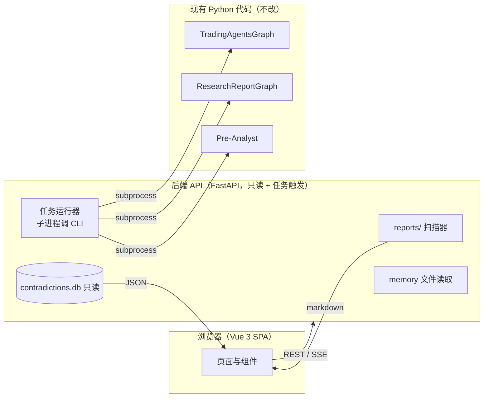
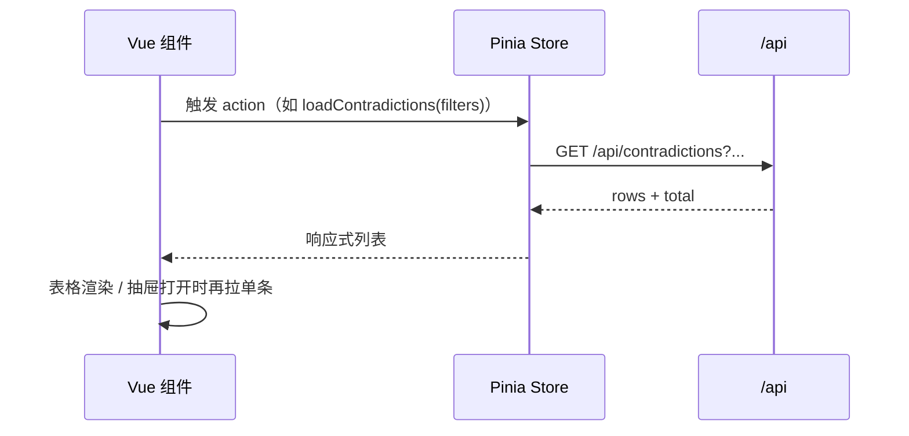

# TradingAgents Vue 前端设计文档

> **状态**: 设计文档 | **版本**: v0.1 | **日期**: 2026-08-15
>
> 关联: [`ARCHITECTURE.md`](../ARCHITECTURE.md)（系统架构）、[`research-report-agents.md`](research-report-agents.md)（研报阅读器）、[`research-report-contradiction.md`](research-report-contradiction.md)（矛盾分析 v3.3）

---

## 目录

1. [目标与范围](#1-目标与范围)
2. [现状盘点：前端要覆盖的功能](#2-现状盘点前端要覆盖的功能)
3. [总体架构](#3-总体架构)
4. [页面与路由](#4-页面与路由)
5. [各页面详细设计](#5-各页面详细设计)
6. [后端 API 设计](#6-后端-api-设计)
7. [前端技术栈与目录结构](#7-前端技术栈与目录结构)
8. [通用组件](#8-通用组件)
9. [状态管理与数据流](#9-状态管理与数据流)
10. [实施路线图](#10-实施路线图)
11. [验收标准](#11-验收标准)

---

## 1. 目标与范围

### 1.1 一句话

**把 TradingAgents 三条功能线已经产出的报告、矛盾库与决策记忆，从"本地 markdown 文件 + SQLite"升级为可浏览、可筛选、可追踪的 Web 界面。**

### 1.2 目标

| 目标 | 说明 |
| --- | --- |
| 报告浏览 | 在浏览器里阅读交易分析报告树、每日研报总结、Pre-Analyst 板块轮动报告 |
| 矛盾追踪 | 浏览/筛选矛盾库（v3.3 数据），查看双方立场、洞察、生命周期 |
| 任务运行 | 从页面上发起分析任务（analyze / reader / pre-analyst），查看进度与历史 |
| 决策记忆 | 浏览决策日志与反思记录 |

### 1.3 非目标

| 非目标 | 说明 |
| --- | --- |
| 实时行情/图表 | 数据由现有 dataflows 层在任务运行中获取，前端不直连行情 |
| 前端直接调 LLM | 所有 LLM 调用仍在 Python 进程内（CLI/图），前端只读产物与下发任务 |
| 交易执行 | 沿用框架的"模拟交易所"，不新增任何下单能力 |
| 替代 CLI | CLI 保留；前端是 CLI 的可视化壳 |

---

## 2. 现状盘点：前端要覆盖的功能

### 2.1 三条功能线

| 功能线 | 入口 | 产物 | 前端页面 |
| --- | --- | --- | --- |
| **主交易图**（多 Agent 交易分析） | `cli analyze` / `main.py` | `reports/{TICKER}_{时间戳}/complete_report.md` + 分层目录 `1_analysts/` `2_research/` `3_trading/` `4_risk/` `5_portfolio/` | 交易分析 |
| **研报阅读器**（5 类研报 + 矛盾分析） | `run_report_reader.py --date` | `reports/{date}/` 下 7 个文件：`macro_summary.md` `industry_summary.md` `stock_summary.md` `strategy_summary.md` `morning_summary.md` `final_summary.md` `contradiction_report.md` | 研报阅读、矛盾追踪 |
| **Pre-Analyst**（板块轮动预分析） | `run_pre_analyst.py --ticker` | `reports/pre_analyst_{时间戳}/`：`cyclical_analyst.md` `growth_analyst.md` `defensive_analyst.md` `sector_manager.md` `complete_report.md` | 交易分析（列表并入） |

### 2.2 数据资产（前端的数据源）

| 资产 | 位置 | 形态 | 读取方式 |
| --- | --- | --- | --- |
| 主图报告树 | `reports/{TICKER}_{ts}/` | markdown 文件树 | 文件系统扫描 |
| 每日研报报告 | `reports/{date}/` | 7 个 markdown | 文件系统扫描 |
| Pre-Analyst 报告 | `reports/pre_analyst_{ts}/` | 5 个 markdown | 文件系统扫描 |
| 矛盾库 | `reports/contradictions.db` | SQLite（`contradictions` 表，含 `insight` JSON 列） | SQLite 只读查询 |
| 决策记忆 | `~/.tradingagents/memory/trading_memory.md`（`TRADINGAGENTS_MEMORY_LOG_PATH` 可覆盖） | 单个 markdown | 文件读取 |
| 配置 | `.env`（`TRADINGAGENTS_*`）与 `default_config.py` | 键值 | 只读展示 |

### 2.3 矛盾数据模型（`contradictions` 表）

前端矛盾页直接映射以下列，**无需理解图内部**：

| 列 | 前端用途 |
| --- | --- |
| `id` | 行唯一键（`subject|brokerA|brokerB|kind`） |
| `subject` / `kind` / `scope` / `scale` | 分组与筛选（中文化映射见矛盾报告 v3.3） |
| `claim_a` / `claim_b`（JSON） | 双方立场卡片：broker、direction（-1/0/1）、quote |
| `status` / `winner` / `resolved_by` / `resolved_date` | 生命周期（open / resolved） |
| `first_seen` / `last_seen` | 时间线与持续天数 |
| `insight`（JSON） | 洞察：`cause_type` / `cause` / `analysis` / `watch` / `tilt` |

---

## 3. 总体架构



设计原则：

1. **后端只读优先**：阶段 1 后端只扫描文件与查 SQLite，不 import TradingAgents 包、不持有 LLM 客户端，启动快、零风险。
2. **任务触发走子进程**：运行分析 = 后端 `subprocess` 调现有入口（`cli analyze` / `run_report_reader.py` / `run_pre_analyst.py`），进程退出即任务结束，与现有 checkpoint 机制天然兼容。
3. **路径安全**：所有文件读取做路径穿越防护（项目已有 `test_ticker_path_handling` 先例），URL 参数只允许 `[A-Za-z0-9._-]`。
4. **前端无状态读取**：所有"计算"（聚合、统计）尽量由 SQL/后端完成，前端只做展示与筛选。

---

## 4. 页面与路由

| 路由 | 页面 | 数据源 | 核心能力 |
| --- | --- | --- | --- |
| `/` | 仪表盘 | overview API | 统计卡片 + 最近运行 + 今日矛盾 Top |
| `/reports/trading` | 交易分析 | 报告树 API | 左树右文，agent 分层阅读 |
| `/reports/daily` | 研报阅读 | 按日期 API | 日期切换 + 7 个报告 tab |
| `/reports/pre` | 板块轮动 | 报告树 API | Pre-Analyst 运行浏览 |
| `/contradictions` | 矛盾追踪 | 矛盾 API | 速览表 + 筛选 + 详情抽屉 |
| `/jobs` | 任务中心 | jobs API + SSE | 发起/监控/历史任务 |
| `/memory` | 决策日志 | memory API | 决策记忆 markdown |
| `/settings` | 设置 | settings API | LLM 配置与模型目录（只读） |

布局：左侧导航栏（应用名 + 8 个入口）+ 顶栏（当前任务运行状态徽标）+ 内容区。移动端导航折叠为抽屉。

---

## 5. 各页面详细设计

### 5.1 仪表盘 `/`

```
┌──────────────────────────────────────────────┐
│ 统计卡片：报告天数 | 矛盾总数 | 未决 | 解决率 │
├──────────────────────────┬───────────────────┤
│ 最近运行（列表）          │ 今日矛盾 Top 5     │
│ 类型 · 标的/日期 · 时间   │ 对象 | 双方 | 天数  │
│ 状态（完成/进行中/失败）  │ （点击跳矛盾详情） │
└──────────────────────────┴───────────────────┘
```

- 矛盾统计直接复用 v3.3 的统计口径（累计/未决/已解决/解决率、类型分布、归因分布）
- 最近运行 = 扫描 `reports/` 目录 mtime 倒序 + 进行中的任务

### 5.2 交易分析 `/reports/trading`

```
┌────────────┬─────────────────────────────────┐
│ 运行列表    │  报告阅读区（markdown 渲染）      │
│ SPY 06-26  │  complete_report.md              │
│ NVDA 07-01 │  ──────────────                  │
│            │  Tab 切换：                       │
│            │  完整报告 / 分析师 / 研究辩论 /    │
│            │  交易 / 风险 / 决策               │
└────────────┴─────────────────────────────────┘
```

- 左侧运行列表按时间倒序；每次运行即 `reports/{TICKER}_{ts}/`
- 右侧默认展示 `complete_report.md`；tab 对应分层目录（`1_analysts` 下 4 个文件、`2_research` 下 3 个、`3_trading`、`4_risk` 下 3 个、`5_portfolio`）
- **Agent 流程卡片**（可选增强）：把 5 个阶段画成横向 stepper，高亮已产出报告的阶段，点击跳对应文件

### 5.3 研报阅读 `/reports/daily`

```
日期选择器 ◀ 2026-08-13 ▶（下拉：有报告的日期）
┌ 宏观研究 │ 行业研报 │ 个股研报 │ 策略报告 │ 券商晨报 │ 综合总结 │ 矛盾报告 ┐
└──────────────────────────────────────────────────────────────┘
        markdown 渲染区（当前 tab 的报告内容）
```

- 7 个 tab 对应 `reports/{date}/` 的 7 个文件；缺文件时 tab 置灰
- `矛盾报告` tab 渲染 v3.3 新格式（概览表 + 折叠洞察，`<details>` 原生可用）
- 综合总结（`final_summary.md`）默认选中

### 5.4 矛盾追踪 `/contradictions`

```
┌ 筛选栏：状态[全部/未决/已解决] · 类型 · 归因 · 对象搜索 · 持续天数范围 ┐
├ 速览表（同 v3.3 概览口径，可排序）                                    │
│ 对象 | 类型 | 甲方[方向] | 乙方[方向] | 持续天数 | 状态 | 洞察归因      │
├──────────────────────────────────────────────────────────────────────┤
│ 点击行 → 右侧抽屉：                                                   │
│   双方 claim 卡片（券商 + 方向徽章 + 完整 quote）                      │
│   洞察（成因/点评/验证/倾向，默认展开）                                │
│   生命周期：首次 X · 最近 Y · 持续 N 天 · winner/resolved_by           │
└──────────────────────────────────────────────────────────────────────┘
```

- 方向徽章：看多=红、看空=绿、中性=灰（A 股习惯配色，配置项可改）
- 筛选条件下推到 SQL（后端 `WHERE`），大数据量不分页即 `LIMIT` + 游标
- 详情抽屉数据单条 API，避免列表接口过重

### 5.5 任务中心 `/jobs`

```
┌ 新建任务 ────────────────────────────────┐
│ 类型：( ) 交易分析  ( ) 研报阅读  ( ) 板块轮动 │
│ 参数表单（随类型变化，见下）                  │
│ [开始运行]                                  │
└────────────────────────────────────────────┘
┌ 运行中任务（SSE 进度：当前 agent / 阶段 / 日志尾部）┐
┌ 历史任务表：类型 | 参数 | 开始/结束 | 耗时 | 状态 ┐
```

参数表单与 CLI 一一对应：

| 任务类型 | 参数 | 底层命令 |
| --- | --- | --- |
| 交易分析 | 标的、日期、分析师勾选、深/浅思考模型、研究深度、输出语言、checkpoint 开关 | `cli analyze` |
| 研报阅读 | 日期、数据根目录 | `run_report_reader.py --date` |
| 板块轮动 | 标的 | `run_pre_analyst.py --ticker` |

- 进度：后端解析子进程 stdout（项目已按 UTF-8 输出），按行推 SSE；任务元数据（类型/参数/状态/时间）存后端一个 JSON 文件即可（`~/.tradingagents/jobs.json`），不引数据库
- 历史"完成"态同时扫描 `reports/` 校验产物是否存在

### 5.6 决策日志 `/memory`

- 单一 markdown 渲染（`trading_memory.md`），顶部显示文件路径与最后修改时间
- 未来增强：按"反思条目"解析出列表（`TradingMemoryLog` 已有结构化读写，后端可复用其读取路径）

### 5.7 设置 `/settings`

- 只读展示：provider、deep/quick 模型、backend_url、checkpoint 开关等（映射 `.env` `TRADINGAGENTS_*` 与 `default_config.py`）
- 模型目录表格：从 `model_catalog.py` 导出静态 JSON（后端启动时生成一次）
- 明确标注"修改请编辑 `.env` 后重启任务"——前端不做配置写入（M3 可选）

---

## 6. 后端 API 设计

FastAPI 单文件服务（`webapi/` 目录），前缀 `/api`。全部返回 JSON；报告内容返回原始 markdown 文本（`text/plain` 或 JSON 字段），前端渲染。

### 6.1 概览与报告

| 方法 | 路径 | 说明 |
| --- | --- | --- |
| GET | `/api/overview` | 统计卡片 + 最近运行 + 矛盾 Top5 |
| GET | `/api/dates` | 有研报报告的日期列表 |
| GET | `/api/reports/{date}` | 该日期 7 个文件的存在性与元信息 |
| GET | `/api/reports/{date}/{name}` | 单个报告 markdown 全文 |
| GET | `/api/trading-runs` | 主图运行列表（`{TICKER}_{ts}`） |
| GET | `/api/trading-runs/{run}/{path}` | 报告树内文件内容（path 相对 run 目录） |
| GET | `/api/pre-runs` | Pre-Analyst 运行列表 |
| GET | `/api/pre-runs/{run}/{path}` | 同上 |

### 6.2 矛盾

| 方法 | 路径 | 说明 |
| --- | --- | --- |
| GET | `/api/contradictions` | 列表；query：`status` `kind` `scope` `scale` `subject` `cause_type` `min_days` `limit` `offset` |
| GET | `/api/contradictions/{id}` | 单条详情（含 insight JSON 展开） |
| GET | `/api/contradictions/stats` | v3.3 统计口径（含类型/归因分布、最长未决） |

- `contradictions.db` 以 `file:...?mode=ro` 只读打开；查询参数白名单拼 SQL（禁止字符串拼接注入）
- `cause_type` 筛选后端从 `insight` JSON 列 `json_extract(insight, '$.cause_type')` 提取

### 6.3 任务与记忆

| 方法 | 路径 | 说明 |
| --- | --- | --- |
| POST | `/api/jobs` | 创建任务：`{type, params}`；校验参数后启动子进程 |
| GET | `/api/jobs` | 历史任务列表 |
| GET | `/api/jobs/{id}` | 单任务状态 |
| GET | `/api/jobs/{id}/events` | SSE 流：stdout 行 + 状态变更 |
| GET | `/api/memory` | 决策记忆 markdown 全文 |

- 任务只允许同时跑 1 个（全局锁，`ponytail:` 单用户场景够用；多用户时升级为每用户 1 任务）
- 子进程环境变量继承后端进程（`.env` 已加载）

### 6.4 安全要点

- 所有路径参数校验 `^[A-Za-z0-9._-]{1,128}$`，并 `resolve()` 后校验前缀在 `reports/` 内
- CORS 仅允许本地来源（开发期 `http://localhost:5173`）

---

## 7. 前端技术栈与目录结构

| 项 | 选型 | 理由 |
| --- | --- | --- |
| 框架 | Vue 3（Composition API）+ TypeScript | 生态成熟、上手快 |
| 构建 | Vite | 秒级 HMR |
| UI 组件 | Element Plus | 表格/抽屉/表单开箱即用，中文文档 |
| 图表 | ECharts | 统计分布图（可选增强） |
| Markdown | `markdown-it`（自定义组件封装） | 渲染报告与 `<details>` |
| 状态 | Pinia | 轻量 |
| 路由 | Vue Router 4 | 标准 |
| 请求 | `fetch` 封装 + EventSource | 不额外引 axios |

```
webui/
├── index.html
├── vite.config.ts          # dev 代理 /api → http://127.0.0.1:8000
├── package.json
└── src/
    ├── main.ts
    ├── App.vue              # 左侧导航 + 顶栏 + router-view
    ├── router/index.ts
    ├── api/
    │   ├── http.ts          # fetch 封装 + 错误提示
    │   ├── reports.ts
    │   ├── contradictions.ts
    │   └── jobs.ts          # 含 SSE 订阅
    ├── stores/
    │   ├── overview.ts
    │   ├── contradictions.ts
    │   └── jobs.ts
    ├── views/
    │   ├── DashboardView.vue
    │   ├── TradingReportsView.vue
    │   ├── DailyReportsView.vue
    │   ├── PreReportsView.vue
    │   ├── ContradictionsView.vue
    │   ├── JobsView.vue
    │   ├── MemoryView.vue
    │   └── SettingsView.vue
    └── components/
        ├── MarkdownViewer.vue
        ├── DirectionBadge.vue
        ├── ContradictionCard.vue
        ├── ContradictionDrawer.vue
        ├── RunCard.vue
        └── StatsCard.vue
```

后端（与前端同仓库，不混包）：

```
webapi/
├── main.py        # FastAPI 应用 + 路由注册
├── reports.py     # reports/ 扫描与安全读取
├── contradictions.py  # SQLite 只读查询
├── jobs.py        # 子进程任务 + SSE
└── settings.py    # 配置展示
```

---

## 8. 通用组件

| 组件 | Props | 职责 |
| --- | --- | --- |
| `MarkdownViewer` | `content: string` | markdown-it 渲染，支持 `<details>`，代码块高亮 |
| `DirectionBadge` | `direction: -1\|0\|1` | 看多/中性/看空徽章（红/灰/绿） |
| `ContradictionCard` | `row: ContradictionRow` | 双方 claim + 洞察摘要（同 v3.3 折叠样式） |
| `ContradictionDrawer` | `rowId: string` | 抽屉详情：claim 卡片、洞察全文、生命周期 |
| `RunCard` | `run: RunInfo` | 运行卡片：类型图标、标的/日期、时间、状态点 |
| `StatsCard` | `label/value/delta` | 仪表盘统计卡片 |

---

## 9. 状态管理与数据流



- 筛选状态（对象/类型/归因/天数）放在 `contradictions` store，组件只读，筛选变更走统一 action——保证 URL query 同步可分享
- `jobs` store 持有 EventSource，任务结束/页面离开时关闭
- 报告内容不缓存（文件可能被重跑覆盖），仅在组件内 `keepAlive` 避免重复请求

---

## 10. 实施路线图

| 阶段 | 内容 | 自检（可运行的最小验证） |
| --- | --- | --- |
| **M1 只读浏览** | 后端 reports/contradictions/memory API + 前端 4 个浏览页（交易分析/研报阅读/矛盾追踪/决策日志） | 打开 `localhost:5173/contradictions` 能看到 2026-08-13 的 28 条矛盾、筛选生效、详情抽屉正确 |
| **M2 任务中心** | jobs API + SSE + 任务表单 + 仪表盘完善 | 页面上发起"研报阅读 2026-08-13"，进度实时滚动，结束后 `reports/` 出现产物 |
| **M3 增强** | 矛盾图表（归因分布）、运行对比、设置页模型目录、Pre-Analyst 页 | 两个日期 final_summary 并排对比渲染 |

M1 完成后即可日常使用；M2/M3 为增量。

---

## 11. 验收标准

| 编号 | 验收项 | 通过条件 |
| --- | --- | --- |
| AC-1 | 报告树浏览 | 任意 `reports/{TICKER}_{ts}/` 的 5 层目录文件均可点击渲染 |
| AC-2 | 每日研报 | 日期切换后 7 个 tab 与 `reports/{date}/` 文件一一对应，缺文件置灰 |
| AC-3 | 矛盾速览 | `/contradictions` 概览表与 `contradiction_report.md` v3.3 口径一致 |
| AC-4 | 矛盾筛选 | `status/kind/cause_type/对象搜索` 组合筛选结果与 SQL 直查一致 |
| AC-5 | 任务触发 | 页面上启动"研报阅读"，SSE 有输出，结束后报告文件落盘 |
| AC-6 | 安全 | `GET /api/trading-runs/../..` 类路径穿越请求一律 400 |
| AC-7 | 零回归 | 前端/后端均不 import `tradingagents` 图模块（任务子进程除外），CLI 行为不变 |
